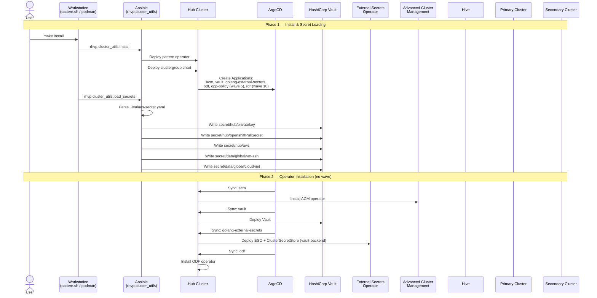
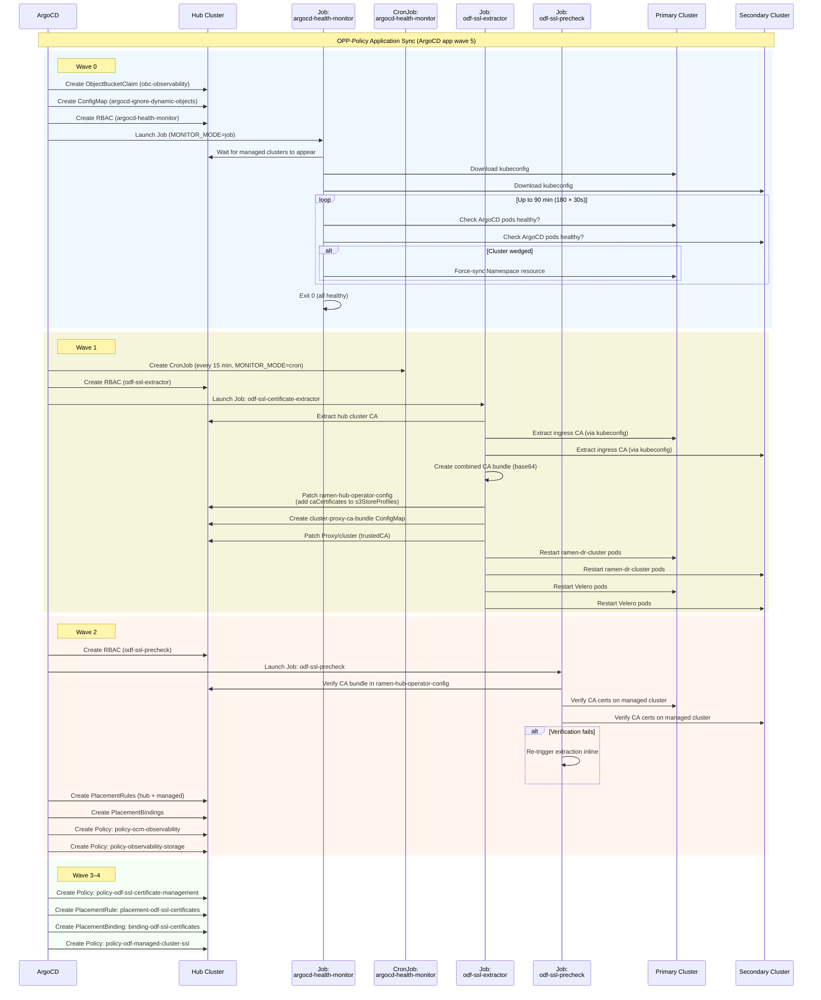
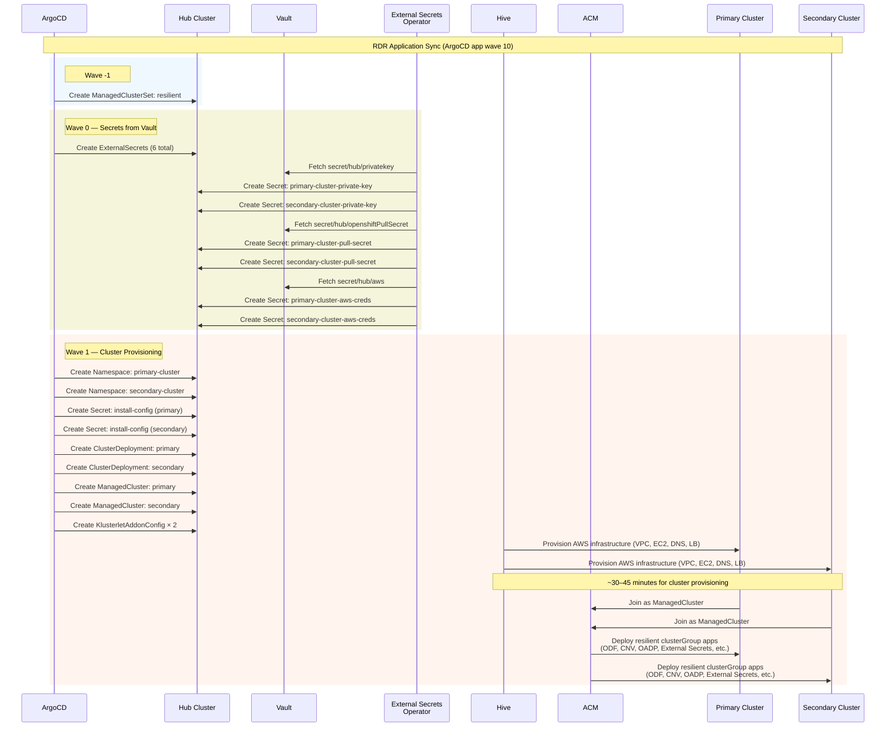
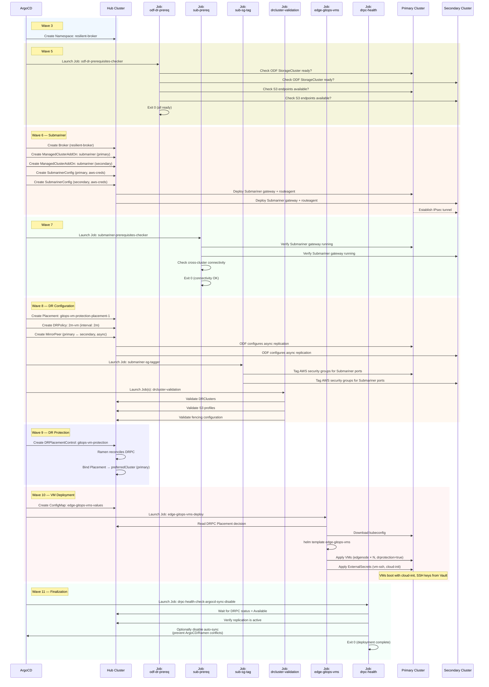
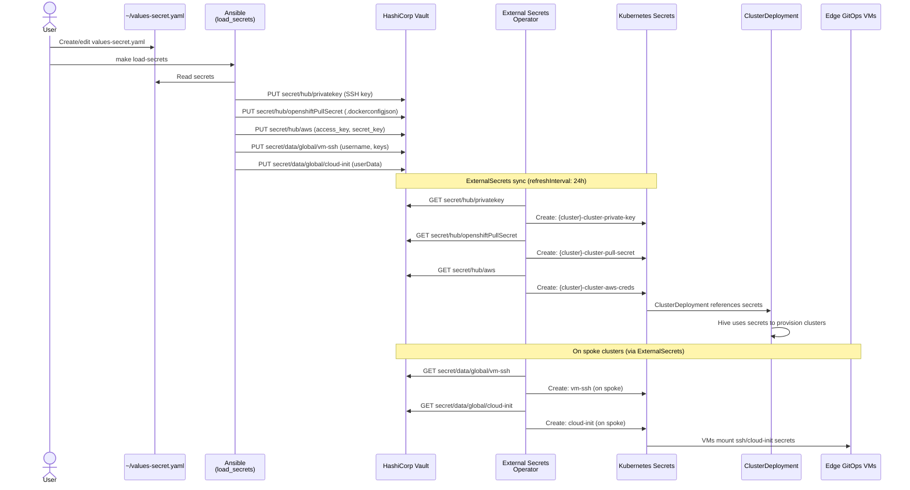
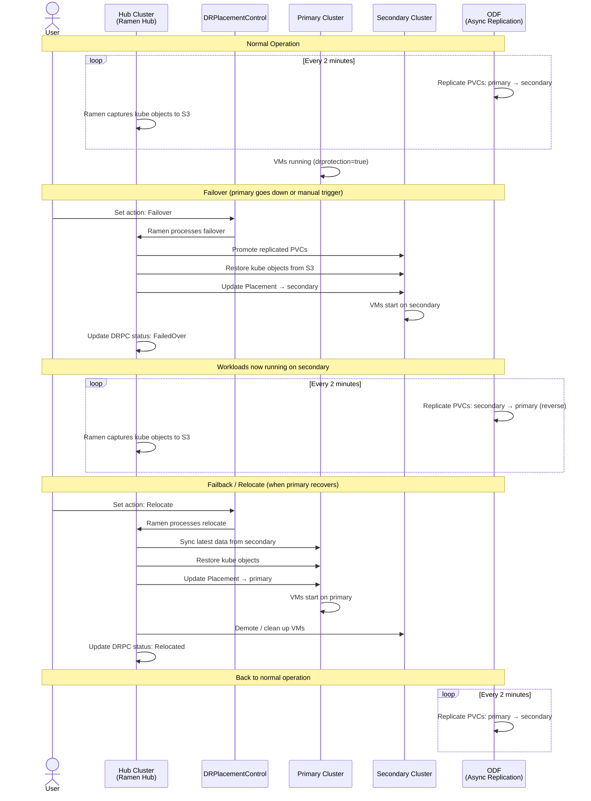
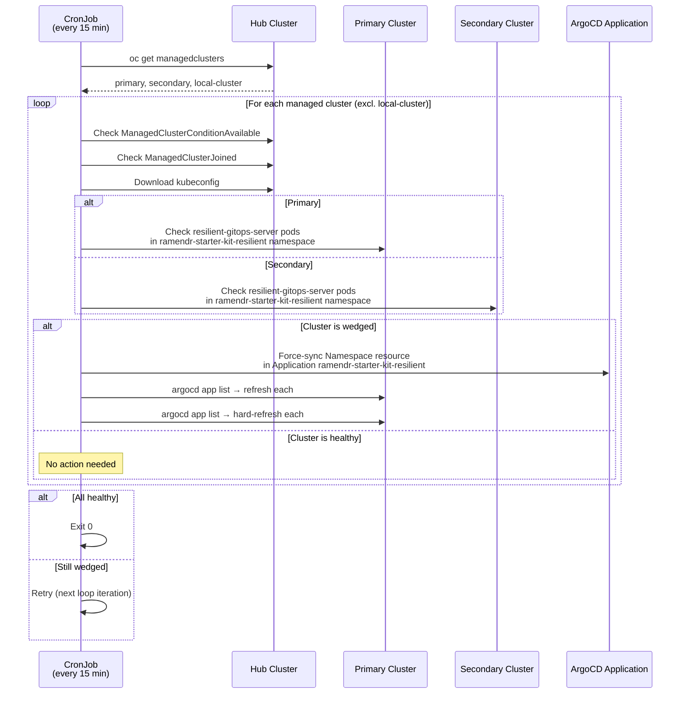

# RamenDR Starter Kit — Sequence Diagrams

## 1. Full Deployment Sequence

## 2. OPP-Policy Chart Sequence (Wave 5)

## 3. RDR Chart Sequence (Wave 10)

## 4. RDR Chart — Networking, DR & VMs (Waves 3–11)

## 5. Secrets Flow Sequence

## 6. Disaster Recovery Sequence — Failover & Failback

## 7. CronJob — Periodic ArgoCD Health Monitor

