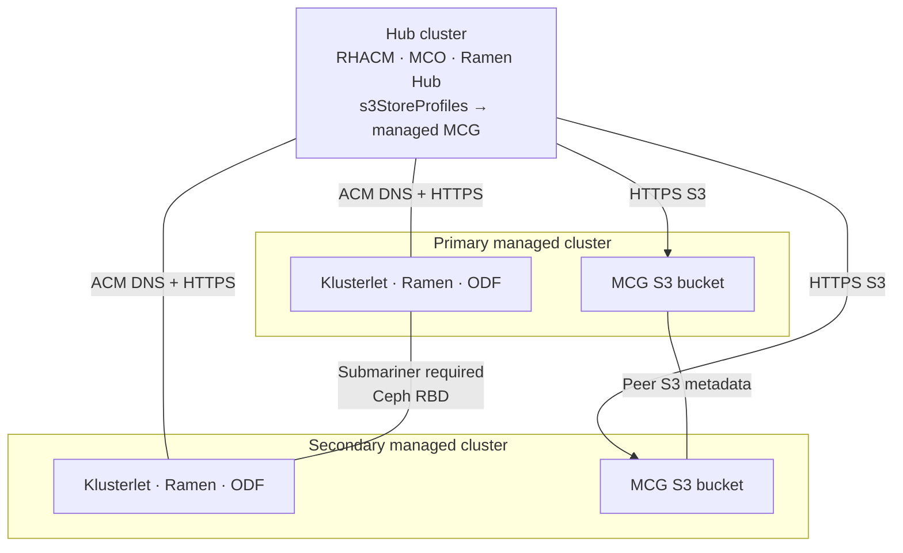
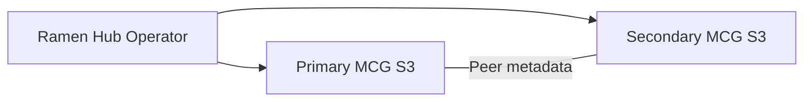
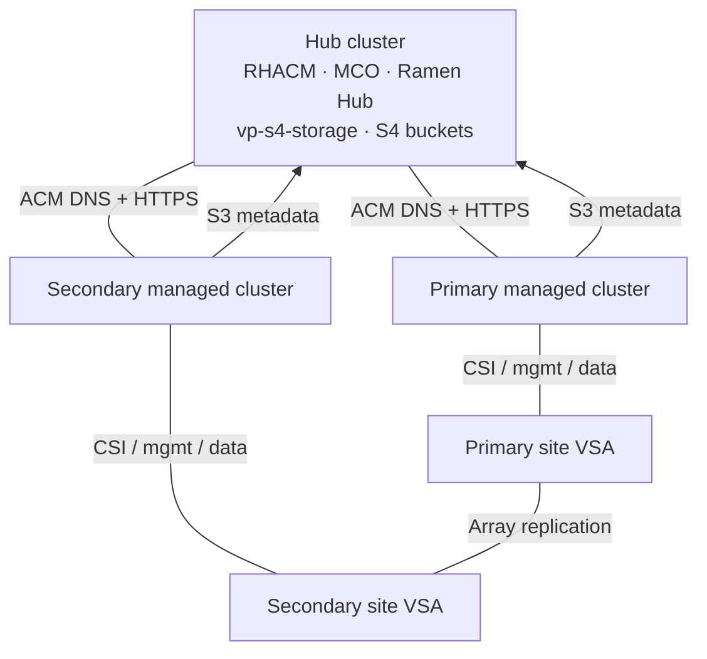
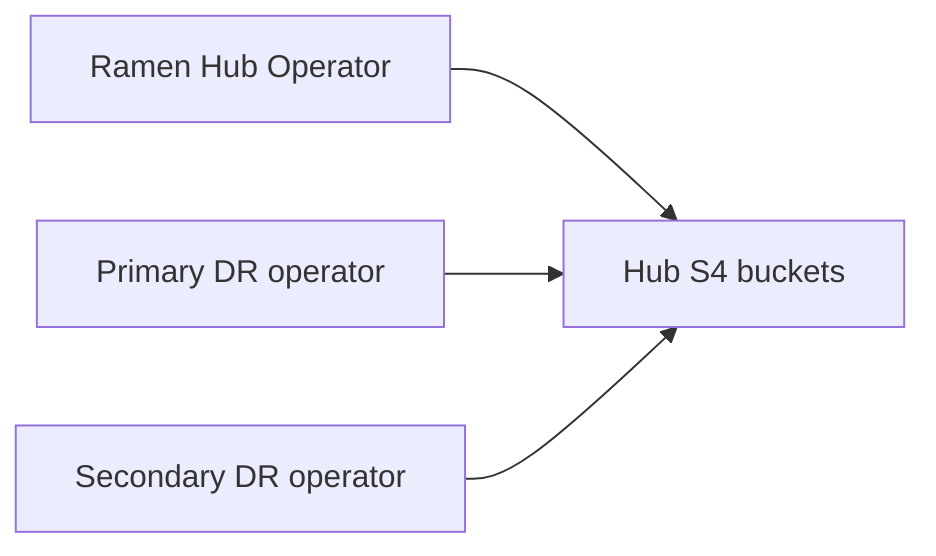
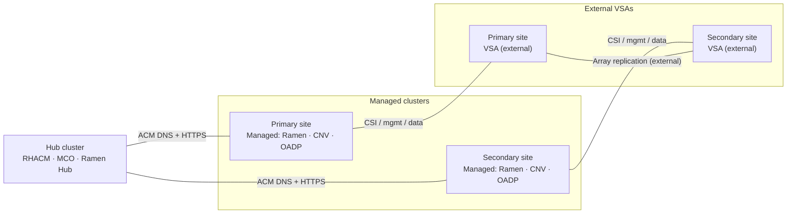

# RamenDR hub ↔ managed connectivity

Three install variants (`main.variant` in `values-global.yaml`):

- **odf** (default) — full ODF Regional DR; MCG S3 on managed clusters; Submariner required for Ceph RBD replication
- **drpartner-s4** — partner CSI + hub S4; array-native volume replication; **Submariner disabled** (`submariner.enabled: false` in opp-policy)
- **drpartner-minimal** — partner CSI operators and Hive/BYOC plumbing only; no S4, DRClusters, or Submariner

> Draw.io source with one tab per variant: [hub-managed-connectivity.drawio](hub-managed-connectivity.drawio).

## Variant comparison

| Concern | odf | drpartner-s4 | drpartner-minimal |
|---------|-----|--------------|-------------------|
| S3 / DR metadata | MCG buckets on each managed cluster | Hub S4 buckets (vp-s4-storage) | None |
| Hub S3 reachability | Hub → each managed MCG endpoint | Hub + managed → hub S4 | n/a |
| Peer S3 | Managed ↔ managed object-bucket metadata | Not used | Not used |
| Volume replication | ODF/Ceph over Submariner | VSA ↔ VSA (array-native) | External / out of pattern |
| Submariner | Required for Regional-DR volumes | **Disabled by default** | **Disabled** |
| DRClusters / DRPolicy | MirrorPeer / MCO / regionaldr | regionaldr (`infrastructureEnabled`) | None |
| DRPC / VMs | Yes (regionaldr resources) | No (`resourcesEnabled: false`) | No |
| ACM + DNS | Required | Required | Required |

## odf

ACM needs DNS resolvability of managed cluster APIs. S3 metadata buckets (MCG) live **on each managed cluster** — hub and peers both reach those endpoints. **Submariner is required** for ODF RBD cross-site replication.

### Managed MCG S3 detail

## drpartner-s4

ACM needs DNS resolvability of managed cluster APIs. S3 metadata lives on **hub S4** (vp-s4-storage). Volume DR is array-native (VSA ↔ VSA). regionaldr creates hub DRClusters and a `2m-novm` DRPolicy only — no DRPC/VMs. **Submariner is not deployed** (`values-opp-policy.yaml` sets `submariner.enabled: false`).

### Hub S4 detail

No managed ↔ managed S3 and no Submariner in `drpartner-s4`.

## drpartner-minimal

ACM needs DNS resolvability of managed cluster APIs. Deploys partner operators (MCO/Ramen, CNV, OADP) and Hive/BYOC plumbing only — **no vp-s4-storage**, no DRClusters, no s3StoreProfiles, and **no Submariner**. Volume DR and S3 metadata are outside this pattern.

## Shared requirements

- **ACM + DNS** — Hub must resolve each managed cluster API hostname, then connect over HTTPS 443 / kube API 6443.
- **TLS / CA trust** — Trust custom certs for S4 (`drpartner-s4`) or MCG endpoints (`odf`) via opp-policy `s3CaInjector` where S3 is used.
- **Globalnet** — For `odf`, enable if managed cluster/service CIDRs overlap.

## Ports

| Path | When | Protocol / ports |
|------|------|------------------|
| Hub DNS → managed API | All variants | DNS UDP/TCP 53 |
| Hub ↔ managed API | All variants | HTTPS 443; kube API 6443 |
| Clients → hub S4 | drpartner-s4 | HTTPS 443 |
| Hub / peers → managed MCG | odf | HTTPS 443 |
| Cluster ↔ local VSA | drpartner-s4, drpartner-minimal | Vendor CSI / iSCSI / NVMe / mgmt |
| VSA ↔ VSA replication | drpartner-s4, drpartner-minimal | Vendor replication ports |
| Submariner | odf only | UDP 4500 / 4800 / 4490 |

## Related diagrams

| Artifact | Location |
|----------|----------|
| Full component schematic (odf) | [ramendr-architecture-odf.drawio](ramendr-architecture-odf.drawio) |
| Full component schematic (drpartner-s4) | [ramendr-architecture-drpartner-s4.drawio](ramendr-architecture-drpartner-s4.drawio) |
| Full component schematic (drpartner-minimal) | [ramendr-architecture-drpartner-minimal.drawio](ramendr-architecture-drpartner-minimal.drawio) |
| Connectivity overview (all variants) | [hub-managed-connectivity.drawio](hub-managed-connectivity.drawio) |
